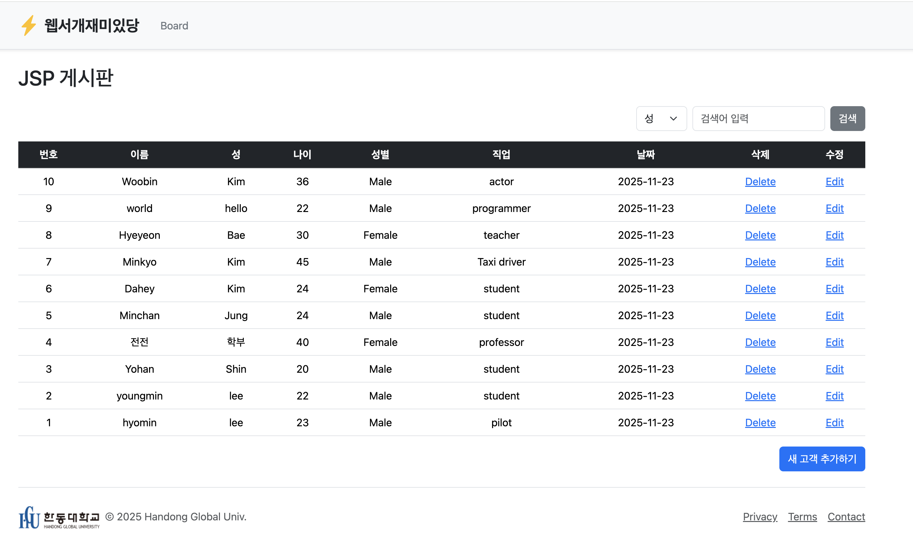
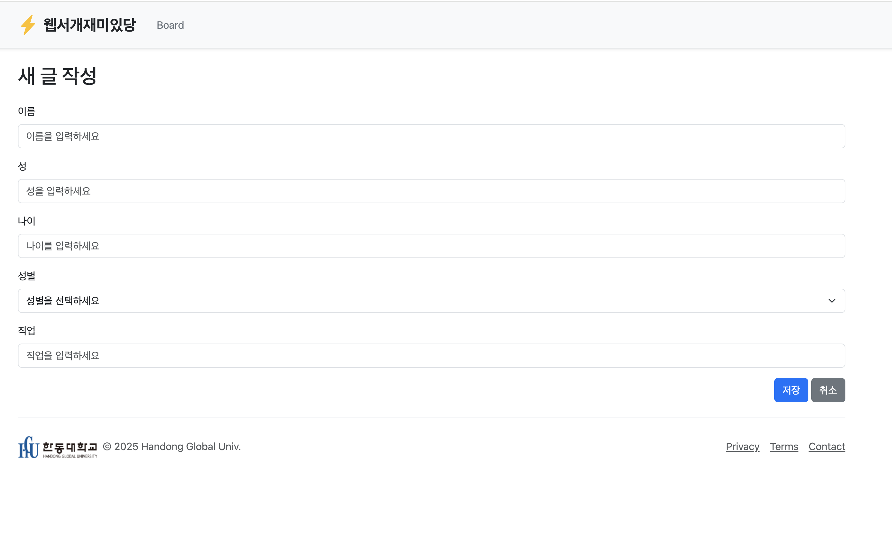
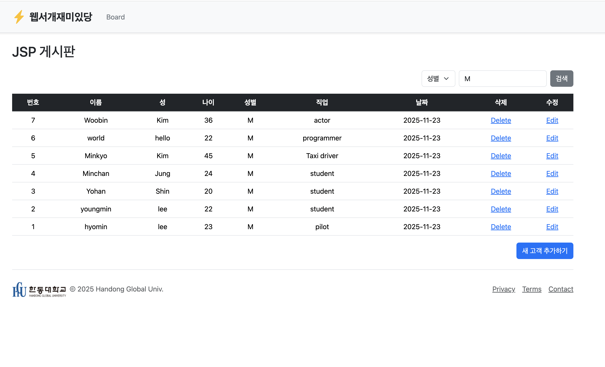

# Project2-2
    This simple website shows the list of data from database and execute several tasks
    such as, create, delete, search and view all. 

# result
1. List view
   
2. Create view
   
3. Search view
   
4. Edit view
   
5. Delete view
   